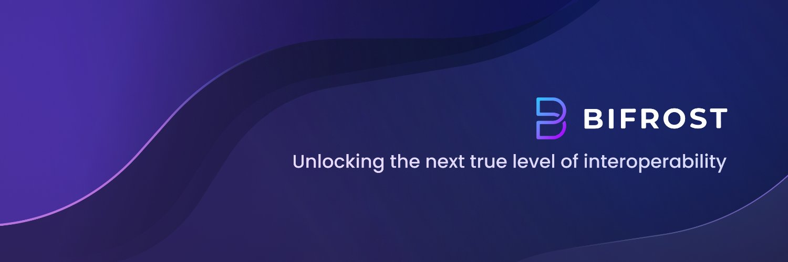

# 

The BIFROST Network is a fast and scalable EVM-compatible blockchain that
provides an all-in-one environment for developers to build multichain DApps.

## Getting Started

Learn to use the BIFROST network with our [technical docs](https://docs.thebifrost.io/bifrost-network).

### BIFROST Network Testnet (ChainID: 49088)
|Public Endpoints (rpc/ws)|
|------|
|https://public-01.testnet.thebifrost.io/rpc|
|https://public-02.testnet.thebifrost.io/rpc|
|wss://public-01.testnet.thebifrost.io/ws|
|wss://public-02.testnet.thebifrost.io/ws|

### BIFROST Network Mainnet (ChainID: 3068)
|Public Endpoints (rpc/ws)|
|------|
|-|
|-|
|-|
|-|

### Rust Setup

First, complete the [basic Rust setup instructions](./docs/rust-setup.md).

### Build

Use the following command to build the node
without launching it:

```sh
cargo build --release
```

### Embedded Docs

Once the project has been built, the following command can be used to explore all parameters and
subcommands:

```sh
./target/release/bifrost-node -h
```

### Build (using docker)

We can also use docker to build the node. Follow the description below:

```sh
docker build . -t bifrost-node
```

#### 3. Run

Best guess to get started is to pass the -h flag. Example:

```sh
docker run --rm -it bifrost-node -h
```

## Run Node

The provided `cargo run` command will launch a temporary node and its state will be discarded after
you terminate the process. After the project has been built, there are other ways to launch the
node.

### Single-Node Development Chain

This command will start the single-node development chain with non-persistent state:

```bash
./target/release/bifrost-node --dev
```

Purge the development chain's state:

```bash
./target/release/bifrost-node purge-chain --base-path ./data --chain dev
```

Start the development chain with detailed logging:

```bash
RUST_BACKTRACE=1 ./target/release/bifrost-node -ldebug --dev
```

> Development chain means that the state of our chain will be in a tmp folder while the nodes are
> running. Also, **Alith** account will be authority and sudo account as declared in the
> [genesis state](https://github.com/bifrost-platform/bifrost-node/tree/main/node/dev/src/chain_spec.rs).
> At the same time the following accounts will be pre-funded:

**Prefunded Development Addresses**
|Name      |Address                                     |Private Key                                                         |
|----------|--------------------------------------------|--------------------------------------------------------------------|
|Alith     |0xf24FF3a9CF04c71Dbc94D0b566f7A27B94566cac  |0x5fb92d6e98884f76de468fa3f6278f8807c48bebc13595d45af5bdc4da702133  |
|Baltathar |0x3Cd0A705a2DC65e5b1E1205896BaA2be8A07c6e0  |0x8075991ce870b93a8870eca0c0f91913d12f47948ca0fd25b49c6fa7cdbeee8b  |
|Charleth  |0x798d4Ba9baf0064Ec19eB4F0a1a45785ae9D6DFc  |0x0b6e18cafb6ed99687ec547bd28139cafdd2bffe70e6b688025de6b445aa5c5b  |
|Dorothy   |0x773539d4Ac0e786233D90A233654ccEE26a613D9  |0x39539ab1876910bbf3a223d84a29e28f1cb4e2e456503e7e91ed39b2e7223d68  |
|Ethan     |0xFf64d3F6efE2317EE2807d223a0Bdc4c0c49dfDB  |0x7dce9bc8babb68fec1409be38c8e1a52650206a7ed90ff956ae8a6d15eeaaef4  |
|Faith     |0xC0F0f4ab324C46e55D02D0033343B4Be8A55532d  |0xb9d2ea9a615f3165812e8d44de0d24da9bbd164b65c4f0573e1ce2c8dbd9c8df  |
|Goliath   |0x7BF369283338E12C90514468aa3868A551AB2929  |0x96b8a38e12e1a31dee1eab2fffdf9d9990045f5b37e44d8cc27766ef294acf18  |
|Heath     |0x931f3600a299fd9B24cEfB3BfF79388D19804BeA  |0x0d6dcaaef49272a5411896be8ad16c01c35d6f8c18873387b71fbc734759b0ab  |
|Ida       |0xC41C5F1123ECCd5ce233578B2e7ebd5693869d73  |0x4c42532034540267bf568198ccec4cb822a025da542861fcb146a5fab6433ff8  |
|Judith    |0x2898FE7a42Be376C8BC7AF536A940F7Fd5aDd423  |0x94c49300a58d576011096bcb006aa06f5a91b34b4383891e8029c21dc39fbb8b  |

In case of being interested in maintaining the chain' state between runs a base path must be added
so the db can be stored in the provided folder instead of a temporal one. We could use this folder
to store different chain databases, as a different folder will be created per different chain that
is ran. The following commands shows how to use a newly created folder as our db base path.

```bash
// Create a folder to use as the db base path
$ mkdir data

// Use of that folder to store the chain state
$ ./target/release/bifrost-node --dev --base-path ./data

// Check the folder structure created inside the base path after running the chain
$ ls ./data
chains
$ ls ./data/chains/
dev
$ ls ./data/chains/dev
db keystore network
```

## Project Structure

A Substrate project such as this consists of a number of components that are spread across a few
directories.

### Node

A blockchain node is an application that allows users to participate in a blockchain network.
Substrate-based blockchain nodes expose a number of capabilities:

- Networking: Substrate nodes use the [`libp2p`](https://libp2p.io/) networking stack to allow the
  nodes in the network to communicate with one another.
- Consensus: Blockchains must have a way to come to
  [consensus](https://docs.substrate.io/main-docs/fundamentals/consensus/) on the state of the
  network. Substrate makes it possible to supply custom consensus engines and also ships with
  several consensus mechanisms that have been built on top of
  [Web3 Foundation research](https://research.web3.foundation/en/latest/polkadot/NPoS/index.html).
- RPC Server: A remote procedure call (RPC) server is used to interact with Substrate nodes.

There are several files in the `node` directory - take special note of the following:

- [`chain_spec.rs`](./node/src/chain_spec.rs): A
  [chain specification](https://docs.substrate.io/main-docs/build/chain-spec/) is a
  source code file that defines a Substrate chain's initial (genesis) state. Chain specifications
  are useful for development and testing, and critical when architecting the launch of a
  production chain. Take note of the `development_config` function, which
  are used to define the genesis state for the local development chain configuration. These
  functions identify some
  [well-known accounts](https://docs.substrate.io/main-docs/fundamentals/accounts-addresses-keys/)
  and use them to configure the blockchain's initial state.
- [`service.rs`](./node/src/service.rs): This file defines the node implementation. Take note of
  the libraries that this file imports and the names of the functions it invokes. In particular,
  there are references to consensus-related topics, such as the
  [longest chain rule](https://docs.substrate.io/main-docs/fundamentals/consensus/#fork-choice-rules),
  the [Aura](https://docs.substrate.io/reference/glossary/#authority-round-aura) block authoring
  mechanism and the
  [GRANDPA](https://docs.substrate.io/reference/glossary/#grandpa) finality
  gadget.

After the node has been [built](#build), refer to the embedded documentation to learn more about the
capabilities and configuration parameters that it exposes:

```shell
./target/release/bifrost-node --help
```

### Runtime

In Substrate, the terms
"[runtime](https://docs.substrate.io/main-docs/fundamentals/runtime-intro/)" and
"[state transition function](https://docs.substrate.io/main-docs/fundamentals/state-transitions-and-storage/)"
are analogous - they refer to the core logic of the blockchain that is responsible for validating
blocks and executing the state changes they define. The Substrate project in this repository uses
the [FRAME](https://docs.substrate.io/reference/frame-pallets/) framework to construct a
blockchain runtime. FRAME allows runtime developers to declare domain-specific logic in modules
called "pallets". At the heart of FRAME is a helpful
[macro language](https://docs.substrate.io/reference/frame-macros/) that makes it easy to
create pallets and flexibly compose them to create blockchains that can address
[a variety of needs](https://www.substrate.io/substrate-users/).

Review the [FRAME runtime implementation](./runtime/src/lib.rs) included in this template and note
the following:

- This file configures several pallets to include in the runtime. Each pallet configuration is
  defined by a code block that begins with `impl $PALLET_NAME::Config for Runtime`.
- The pallets are composed into a single runtime by way of the
  [`construct_runtime!`](https://crates.parity.io/frame_support/macro.construct_runtime.html)
  macro, which is part of the core
  [FRAME Support](https://docs.substrate.io/reference/frame-pallets/)
  library.

### Pallets

The runtime in this project is constructed using many FRAME pallets that ship with the
[core Substrate repository](https://github.com/paritytech/substrate/tree/master/frame) and a
template pallet that is [defined in the `pallets`](./pallets/template/src/lib.rs) directory.

A FRAME pallet is compromised of a number of blockchain primitives:

- Storage: FRAME defines a rich set of powerful
  [storage abstractions](https://docs.substrate.io/main-docs/build/runtime-storage/) that makes
  it easy to use Substrate's efficient key-value database to manage the evolving state of a
  blockchain.
- Dispatchables: FRAME pallets define special types of functions that can be invoked (dispatched)
  from outside of the runtime in order to update its state.
- Events: Substrate uses [events and errors](https://docs.substrate.io/main-docs/build/events-errors/)
  to notify users of important changes in the runtime.
- Errors: When a dispatchable fails, it returns an error.
- Config: The `Config` configuration interface is used to define the types and parameters upon
  which a FRAME pallet depends.
